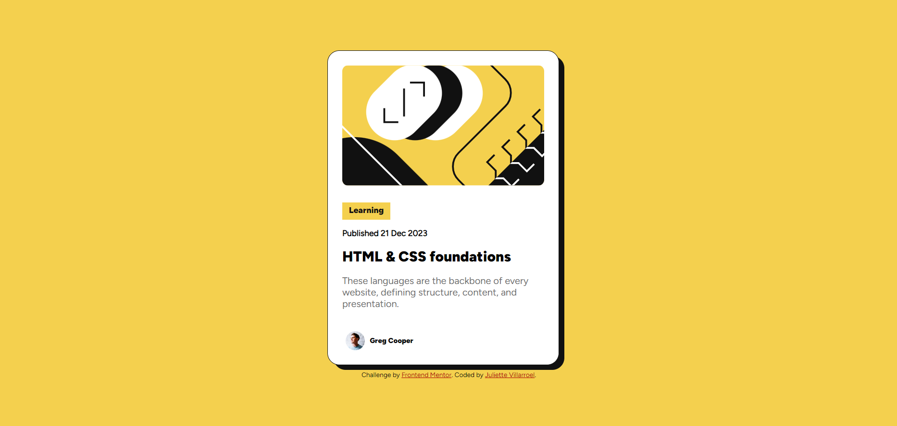

# Frontend Mentor - Blog preview card solution

This is a solution to the [Blog preview card challenge on Frontend Mentor](https://www.frontendmentor.io/challenges/blog-preview-card-ckPaj01IcS). Frontend Mentor challenges help you improve your coding skills by building realistic projects. 

## Table of contents

- [Overview](#overview)
  - [The challenge](#the-challenge)
  - [Screenshot](#screenshot)
  - [Links](#links)
- [My process](#my-process)
  - [Built with](#built-with)
  - [What I learned](#what-i-learned)
  - [Continued development](#continued-development)
  - [Useful resources](#useful-resources)
- [Author](#author)
- [Acknowledgments](#acknowledgments)

**Note: Delete this note and update the table of contents based on what sections you keep.**

## Overview

### The challenge

Users should be able to:

- See hover and focus states for all interactive elements on the page

### Screenshot



### Links

- Solution URL: [GitHub Page](https://github.com/juliettedb-v/social-links-profile-main-challenge)
- Live Site URL: [GitHub Pages Challenge Solution](https://juliettedb-v.github.io/social-links-profile-main-challenge/)

## My process

I started by creating my HTML the best way possible, then I focused on the distribution by checking on the figma file which was really helpful I inmediately notice how easy is to check design instead of a picture. It was a fun experience, not my first time working with figma but this one was easier. I built all my html and put together my styles, it was more fun with a good playlist!

### Built with

- Semantic HTML5 markup
- CSS custom properties
- Flexbox


### What I learned

Once again, I'm proud of my basic responsive design

```css
    @media (max-width:640px) {
      .border {
        width: 20rem;
        height: 31rem;
        justify-content: center;
      }

      .card-container{
        width: 20rem;
        height: 31rem;
        justify-content: center;
      }

      .img-container { 
        border-radius: 10px;
      }

      .img-container img {
        width: 17rem;
      }

      .profile-container {
        padding: 4px 24px;
      }


      .attribution {
        padding: 6rem;
      }
    }

```

### Continued development

I will be focusing on CSS Grid now, but I want to keep practicing with these small proyects, so you'll see more!

**Note: Delete this note and the content within this section and replace with your own plans for continued development.**

### Useful resources

- [Px to rem conversor](https://nekocalc.com/es/px-a-rem-conversor) - This helped me to converse all my px values to rem, it was faster.
- [Iconic cssreference.io](https://cssreference.io) - This helped me a lot to check on properties.

## Author

- Website - [Juliette](https://github.com/juliettedb-v/blog-preview-card-challenge-main)
- Frontend Mentor - [@juliettedb-v](https://www.frontendmentor.io/profile/juliettedb-v)

## Acknowledgments

Taking Platzi's courses really helped me out to understand basic knowledge that I needed for completing this challenge. I know it's helpful for a lot of hispanics out there and I highly recommend it.
